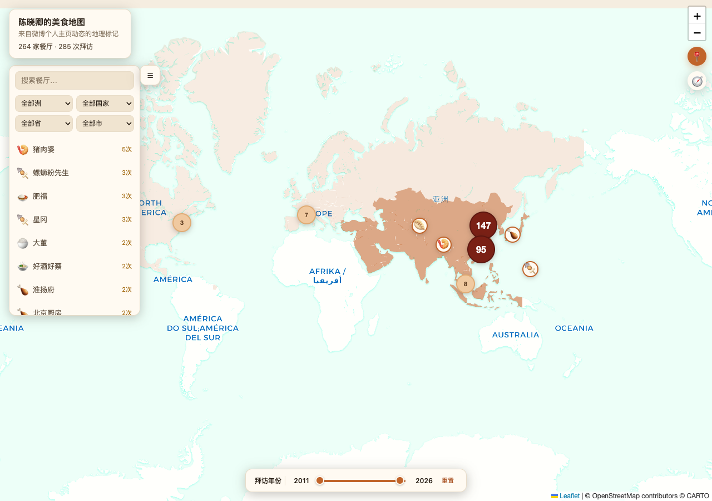

<p align="center">
  
</p>

<p align="center">
  
  
  
  
  
</p>

<p align="center">
  <a href="#在线演示">在线演示</a> ·
  <a href="#快速开始">快速开始</a> ·
  <a href="#原理">原理</a> ·
  <a href="#已知限制">已知限制</a>
</p>

---

抓取美食博主的微博个人主页动态,识别带地理位置标记的餐馆,用 AI 抽取推荐菜品和拜访时间,生成可视化地图。

---

## 🗺 效果



> 以陈晓卿(@陈晓卿)公开微博主页动态抓取、抽取生成,截图为真实数据(餐厅名/菜品/引用均来自其公开发布的内容)。仓库自带这份示例数据(`data/陈晓卿/restaurants.json`),可直接看在线演示或克隆后 `node server.mjs` 本地打开。

## 在线演示

**👉 [alloevil.github.io/foodmap](https://alloevil.github.io/foodmap/)**

纯静态托管在 GitHub Pages(`index.html` 直接 fetch `data/<name>/restaurants.json`,本地和线上是同一套代码,没有独立的后端 API)。默认展示随仓库附带的陈晓卿示例数据;换 `?name=<博主名>` 可切换到你自己本地跑出来的数据(需要该数据也被部署到同一站点)。

## 快速开始

```bash
npm install
cp config.example.json config.json        # 可选:指定 Chrome 路径,不填则自动探测
cp ai-config.example.json ai-config.json   # 必填:配置你的 LLM API(OpenAI-compatible)

# 1. 登录 weibo.com 主站(扫码,Cookie 存到本地 cookies.json,与其他项目隔离)
node login.mjs

# 2. 确认博主的数字 UID(在浏览器打开博主主页,从 URL 读取,如 weibo.com/u/1647375747)
#    也可用 https://weibo.com/ajax/profile/info?screen_name=<昵称> 反查(需带登录 Cookie)

# 3. 先探测一下(只抓 1-2 页,不落盘,打印位置字段命中情况)
node fetch-posts.mjs --uid <uid> --name <博主名> --probe

# 4. 正式抓取全部历史动态(首次建议 --mode full)
node fetch-posts.mjs --uid <uid> --name <博主名> --mode full

# 5. 识别餐馆 + 抽取推荐菜品(调用 ai-config.json 里配置的模型)
node extract-restaurants.mjs --name <博主名>

# 6. 起地图页(纯静态文件 server,与 GitHub Pages 行为一致)
node server.mjs
# 打开 http://localhost:3457/?name=<博主名>(不带 ?name= 默认看陈晓卿示例数据)
```

## 原理

1. **抓取**(`fetch-posts.mjs`):分页请求 `weibo.com/ajax/statuses/mymblog`,按动态 id 增量合并去重,存到 `data/<博主名>/posts_raw.json`(这份原始全量数据默认不进 git,体量大且含大量与餐馆无关的私人动态原文)。
2. **位置识别**(`normalize.mjs`):微博动态的位置信号主要是 `geo` 字段(`{type:'Point', coordinates:[纬度,经度]}`,**注意坐标顺序与标准 GeoJSON 相反**),辅以少量签到卡片(`url_struct` 里 `object_type==='place'`)。这两种都不带餐厅名/菜品,只给坐标。
3. **AI 抽取**(`extract.mjs` + `extract-restaurants.mjs`):把带位置信号、非转发的动态正文批量喂给 LLM,判断"是否在描述一次具体餐馆就餐",抽取餐厅名和推荐菜品;输出用管道分隔的行式协议而非 JSON(聊天文本常带引号/换行,JSON 转义很容易出错)。
4. **聚合**:同名餐厅合并成一条,多次拜访按时间排序。
5. **展示**(`index.html` + `server.mjs`):Leaflet + CARTO 暗色底图(免 API key),点击标记弹出该餐厅所有拜访记录(日期/菜品/引用/原微博链接)。`restaurants.json` 是唯一被地图页消费的数据文件,体量小(几十到几百 KB),可以放心提交进 git 公开展示。

## 已知限制

- 只收录官方"位置(geo)"或"签到卡片"标记过的动态,纯文字提到餐馆但没打位置标签的不会被收录。实测陈晓卿账号命中率约 18%(1131/6129 条原创动态带位置信号)。
- 转发(retweet)动态一律跳过,位置信息属于被转发者,不代表博主本人的拜访。
- 餐厅去重按"名称完全一致"聚合,同一家店的不同写法(如"海天总部" vs "佛山海天总部食堂")不会自动合并。
- 微博对个人主页接口的访问需要 weibo.com 主站的登录会话,与其他微博工具/项目的登录状态互不相通,请用 `login.mjs` 单独登录。

## 文件说明

| 文件 | 作用 |
|---|---|
| `weibo-cookies.mjs` | Cookie 存取(独立文件,不与其他项目共用) |
| `login.mjs` | 扫码登录 weibo.com 主站 |
| `normalize.mjs` | 微博动态字段裁剪/归一(纯函数) |
| `fetch-posts.mjs` | 抓取个人主页动态(CLI) |
| `extract.mjs` | 位置识别 + LLM 抽取 + 按餐厅聚合(纯函数) |
| `extract-restaurants.mjs` | 调用 extract.mjs 的 CLI |
| `index.html` / `server.mjs` | 地图展示页 + 纯静态文件 server(本地/GitHub Pages 通用) |
| `verify-render.js` | Puppeteer 冒烟测试,截图确认标记正常渲染 |
| `data/<博主名>/posts_raw.json` | 归一化后的原始动态(增量合并,默认 gitignore) |
| `data/<博主名>/restaurants.json` | 最终结构化餐厅数据,地图页直接读取,可提交公开 |

## 测试

```bash
npm test
```

## License

MIT
