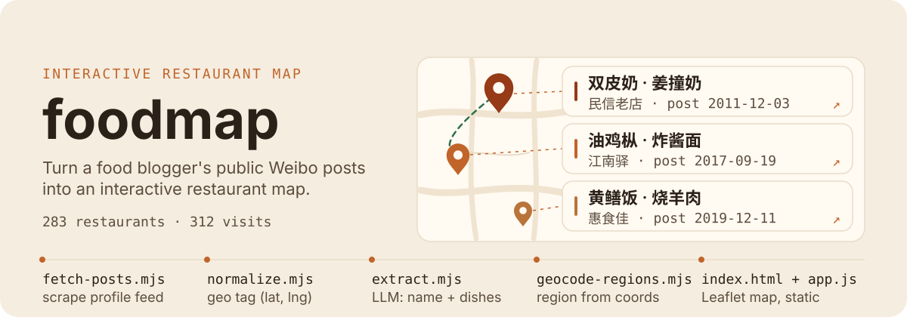
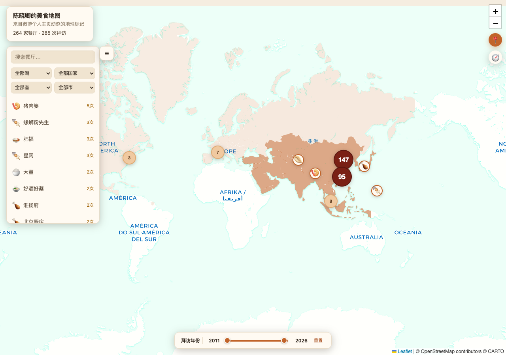

# foodmap(美食地图)

**foodmap** 是一个把美食博主公开微博动态变成可交互餐馆地图的工具,面向"宁愿去你信任的博主真的吃过的店,也不看平台平均分"的人。

[English](README.md) | 简体中文

<p align="center">
  
</p>

<p align="center">
  
  
  
  
  
</p>

<p align="center">
  <a href="#在线演示">在线演示</a> ·
  <a href="#功能">功能</a> ·
  <a href="#快速开始">快速开始</a> ·
  <a href="#原理">原理</a> ·
  <a href="#已知限制">已知限制</a>
</p>

---

## 这是什么

抓取美食博主的微博个人主页动态,识别带地理位置标记的餐馆,用 AI 抽取推荐菜品和拜访时间,生成可视化地图。

---

## 🗺 效果



> 以陈晓卿(@陈晓卿)公开微博主页动态抓取、抽取生成,截图为真实数据(餐厅名/菜品/引用均来自其公开发布的内容)。**该图摄于更早的一次抽取:当时这位博主是 264 家餐馆 / 285 次拜访;现在仓库里的数据是他 252 / 281,两位博主合计 283 家餐馆 / 312 次拜访(数据截至 2026-07-23,2026-09-08 复核)**——当前数字见 `claims.json` 与在线演示。想让图与当前数据一致,用仓库自带工具重拍:一个终端跑 `node server.mjs`,另一个终端跑 `node verify-render.js --name 陈晓卿`(需先 `npm install` 且本机有 Chrome;输出写在 `/tmp/foodmap-screenshot.png`)。仓库自带这份示例数据(`data/陈晓卿/restaurants.json`),可直接看在线演示或克隆后 `node server.mjs` 本地打开。

## 在线演示

**👉 [alloevil.github.io/foodmap](https://alloevil.github.io/foodmap/)**

纯静态托管在 GitHub Pages(`index.html` 直接 fetch `data/<name>/restaurants.json`,本地和线上是同一套代码,没有独立的后端 API)。仓库自带陈晓卿、隋坡两位博主的示例数据,页面顶部下拉框可以切换,也可以选"全部"合并看;换 `?name=<博主名>` 也能直接跳到某一位,或用 `?name=all` 直达合并视图。

## 功能

- **多博主切换**:顶部下拉框在已收录的博主之间切换,也可以选"全部"合并查看
- **聚类地图**:密集区域收成数字气泡,按气泡里的地点数量分级配色;标记大小随该店的拜访次数增大,一眼看出常去的地方
- **侧栏列表**:可搜索,按洲/国/省/市级联筛选(坐标反查得到,比发帖 IP 更准),默认收起;每次打开页面都会有一个箭头提示指向列表按钮(点掉或开始操作地图后消失)
- **拜访年份滑块**:双手柄区间选择,只看某段时间去过的餐厅
- **定位我**:按浏览器定位算距离,列出附近好吃的
- **旅行轨迹回放**:按时间顺序播放拜访路线,近距离用汽车图标走弧线街道级视角,远距离切换成飞机图标飞弧线航线并自动缩小地图容纳起终点;每年一个颜色,经过的每个地点留一个小图标
- **按洲上色的背景图层**:颜色深浅代表该洲拜访次数多少,跟筛选联动
- **移动端适配**,以及暖色底图(CSS 滤镜调色,随缩放层级调整强度)

## 安装

需要 Node.js >= 18。Puppeteer 随 `npm install` 一起装好;AI 抽取那一步还需要一个 OpenAI 兼容的 LLM API。

```bash
git clone https://github.com/alloevil/foodmap.git
cd foodmap
npm install

cp config.example.json config.json         # 可选:指定 Chrome 路径,不填则自动探测
cp ai-config.example.json ai-config.json   # 必填(仅抽取步骤需要):baseUrl / apiKey / model
```

这两个配置文件都不在仓库里,只提交了 `.example` 模板,所以第一次跑抽取之前必须自己各复制一份。只想看现成数据的话可以完全跳过配置,直接 `node server.mjs`:仓库自带的两位博主数据不需要任何 key、也不需要登录就能渲染出完整地图。

## 快速开始

```bash
npm install
cp config.example.json config.json        # 可选:指定 Chrome 路径,不填则自动探测
cp ai-config.example.json ai-config.json   # 必填:配置你的 LLM API(OpenAI-compatible)

# 1. 登录 weibo.com 主站(扫码,Cookie 存到本地 cookies.json,与其他项目隔离)
node login.mjs

# 2. 确认博主的数字 UID(在浏览器打开博主主页,从 URL 读取,如 weibo.com/u/1647375747)
#    也可用 https://weibo.com/ajax/profile/info?screen_name=<昵称> 反查(需带登录 Cookie)

# 3. 先探测一下(只抓 1-2 页,不落盘,打印位置字段命中情况)
node fetch-posts.mjs --uid <uid> --name <博主名> --probe

# 4. 正式抓取全部历史动态(首次建议 --mode full)
node fetch-posts.mjs --uid <uid> --name <博主名> --mode full

# 5. 识别餐馆 + 抽取推荐菜品(调用 ai-config.json 里配置的模型)
node extract-restaurants.mjs --name <博主名>

# 6. (可选)反查每家餐厅所在的洲/国/省/市,给侧栏的地区筛选和洲背景色用;
#    免费 Nominatim 接口,限速 1 请求/秒,数据量大时会跑一会儿
node geocode-regions.mjs --name <博主名>

# 7. 把博主名加进 data/bloggers.json(一个 JSON 字符串数组),这样地图页顶部
#    的博主切换下拉框才会列出这个人,以及能在"全部"里合并看到他的数据

# 8. 起地图页(纯静态文件 server,与 GitHub Pages 行为一致)
node server.mjs
# 打开 http://localhost:3457/?name=<博主名>(不带 ?name= 默认看陈晓卿示例数据,
# ?name=all 合并展示 bloggers.json 里列出的所有博主)
```

## 原理

1. **抓取**(`fetch-posts.mjs`):分页请求 `weibo.com/ajax/statuses/mymblog`,按动态 id 增量合并去重,存到 `data/<博主名>/posts_raw.json`(这份原始全量数据默认不进 git,体量大且含大量与餐馆无关的私人动态原文)。
2. **位置识别**(`normalize.mjs`):微博动态的位置信号主要是 `geo` 字段(`{type:'Point', coordinates:[纬度,经度]}`,**注意坐标顺序与标准 GeoJSON 相反**),辅以少量签到卡片(`url_struct` 里 `object_type==='place'`)。这两种都不带餐厅名/菜品,只给坐标。
3. **AI 抽取**(`extract.mjs` + `extract-restaurants.mjs`):把带位置信号、非转发的动态正文批量喂给 LLM,判断"是否在描述一次具体餐馆就餐",抽取餐厅名和推荐菜品;输出用管道分隔的行式协议而非 JSON(聊天文本常带引号/换行,JSON 转义很容易出错)。
4. **聚合**:同一位博主的数据里,同名餐厅合并成一条,多次拜访按时间排序;"全部"视图是把每位博主的文件直接拼接,所以两位博主都用过的店名会出现两次(当前数据里有 2 个这样的名字)。
5. **地区反查**(`geocode-regions.mjs`,可选):用坐标反查洲/国/省/市——比微博发帖时的 IP 归属地更准,因为餐厅的实际位置不该取决于博主发帖时人在哪。免 API key(Nominatim),按坐标缓存减少重复请求。
6. **展示**(`index.html` + `app.js` + `server.mjs`):Leaflet + CARTO Voyager 暖色底图(免 API key,叠加 CSS 滤镜调色),点击标记弹出该餐厅所有拜访记录(日期/菜品/引用/原微博链接)。`restaurants.json` 是地图页唯一按博主拆分的数据文件(页面还会 fetch `data/bloggers.json` 拿博主列表),体量小(几十到几百 KB),可以放心提交进 git 公开展示。

## 什么时候适合用

- 你信任某几位美食博主,想要他们真正去过、并且写过推荐菜的店,而不是平台上的全网平均分。
- 你要去某个城市,想先看这些博主在这座城市吃过什么——侧栏的洲/国/省/市级联筛选就是为这个做的。
- 你想要一张可以自己托管、数据完全在自己手里的地图:纯静态、无后端,每位博主的数据就是一个可读的 JSON 文件。
- 你想看时间维度的变化:拜访年份滑块和轨迹回放能看出一位博主几年里的探店路线。

## 什么时候不要用

- 你想收录博主只用文字提过、没打位置标签的店。只有带官方位置(geo)标记或签到卡片的动态会被收录;作者在陈晓卿账号上的本地抓取实测命中率约 18%(1131/6129 条原创动态),这个数字在仓库里无法复算,因为 `posts_raw.json` 被 gitignore(详见「已知限制」)。
- 你想要某座城市完整的餐厅数据库。收录量完全取决于你抓了几位博主、他们发过多少带位置的动态,这不是一个覆盖性数据集。
- 你不想登录微博。个人主页动态接口需要 weibo.com 主站的登录会话,且与其他微博工具的登录状态互不相通,得用 `login.mjs` 单独扫码登录。
- 你不想引入 LLM。判断"这条动态是不是在讲一次具体的餐馆就餐"以及抽取菜品都依赖 LLM,没有 `ai-config.json` 只能浏览现成数据,无法收录新博主。
- 你需要同品牌不同分店自动合并,或跨城市的不同写法自动对齐。去重只在名称完全一致、或"一个名字是另一个的子串且坐标相距 500m 以内"时合并——这是刻意的取舍,细节见下面的「已知限制」。

## 已知限制

- 只收录官方"位置(geo)"或"签到卡片"标记过的动态,纯文字提到餐馆但没打位置标签的不会被收录。实测陈晓卿账号命中率约 18%(1131/6129 条原创动态带位置信号)——**这个数字来自作者本地的原始抓取,在仓库里无法复算**,因为 `data/<博主名>/posts_raw.json` 被 gitignore 掉了。仓库里唯一有据可查的实测是 `normalize.mjs` 自己的探测:某个测试账号 25 条样本里 13 条命中(约 52%,2026-07)。
- 转发(retweet)动态一律跳过,位置信息属于被转发者,不代表博主本人的拜访。
- 餐厅去重先按"名称完全一致"聚合,再把"名字一个是另一个的子串、坐标又在 500m 内"的合并成一条(如"柴氏" / "甘家口柴氏"),这样同一家店的不同写法不会在地图上留两个点。反过来,同品牌的不同分店(如"大董" vs "大董金宝汇店",坐标差十几公里)会保持独立——只按名称合并会把地图上两个真实存在的点吞成一个。跨市的不同写法(如"海天总部" vs "佛山海天总部食堂")仍然合不上。
- 微博对个人主页接口的访问需要 weibo.com 主站的登录会话,与其他微博工具/项目的登录状态互不相通,请用 `login.mjs` 单独登录。
- 地区反查(`geocode-regions.mjs`)是可选步骤,没跑过的话侧栏的地区筛选和洲背景色都不会显示,不影响其他功能。

## 文件说明

| 文件                                   | 作用                                                                                                                                                       |
| -------------------------------------- | ---------------------------------------------------------------------------------------------------------------------------------------------------------- |
| `weibo-cookies.mjs`                    | Cookie 存取(独立文件,不与其他项目共用)                                                                                                                     |
| `login.mjs`                            | 扫码登录 weibo.com 主站                                                                                                                                    |
| `normalize.mjs`                        | 微博动态字段裁剪/归一(纯函数)                                                                                                                              |
| `fetch-posts.mjs`                      | 抓取个人主页动态(CLI)                                                                                                                                      |
| `extract.mjs`                          | 位置识别 + LLM 抽取 + 按餐厅聚合(纯函数)                                                                                                                   |
| `extract-restaurants.mjs`              | 调用 extract.mjs 的 CLI                                                                                                                                    |
| `geocode-regions.mjs`                  | 坐标反查洲/国/省/市(纯函数 + CLI,可选步骤)                                                                                                                 |
| `index.html` / `app.js` / `server.mjs` | 地图展示页(结构/样式在 html,交互逻辑在 app.js,零构建直接引入)+ 纯静态文件 server(本地/GitHub Pages 通用;server 默认只监听 127.0.0.1,要对外暴露传 `--host`) |
| `assets/continents.geojson`            | 洲背景色图层用的世界国家边界数据(裁剪到只留一个 `continent` 属性;文件本身没有记录来源,README 早先写的"来自 Natural Earth 110m"在仓库里没有任何佐证)        |
| `verify-render.js`                     | Puppeteer 冒烟测试,截图确认标记正常渲染                                                                                                                    |
| `data/<博主名>/posts_raw.json`         | 归一化后的原始动态(增量合并,默认 gitignore)                                                                                                                |
| `data/<博主名>/restaurants.json`       | 最终结构化餐厅数据,地图页直接读取,可提交公开                                                                                                               |
| `data/bloggers.json`                   | 已收录博主名单,驱动地图页顶部的切换下拉框和"全部"合并视图                                                                                                  |

## 测试

```bash
npm test              # 单元测试(node:test,零框架依赖):纯函数管线 + server 路径解析 + map-core 前端纯逻辑
npm run test:coverage # 同上,附覆盖率表(CI 里跑的是这个)
npm run test:e2e      # 端到端交互测试:起真实 server + Chrome,钉住曾出过 bug 的交互
                      # (筛选/搜索联动地图、空集回放守卫、移动端侧栏让位等);需要本机装有 Chrome,不进 CI
```

前端拆成两层测:不碰 DOM/Leaflet 的纯逻辑(格式化、搜索匹配、弧线数学)在 `map-core.mjs`,浏览器和 `node:test` 共用同一份代码直接单测;DOM/地图交互靠 `e2e.mjs` 全流程验。`verify-render.js` 是更快的一眼冒烟(数标记+截图),开发时顺手跑。

## 常见问题

**数据来自哪里?** 全部来自美食博主公开发布的微博个人主页动态:餐厅坐标来自动态里的官方 `geo` 字段或签到卡片,餐厅名和推荐菜品由 LLM 从公开正文中抽取,行政区划由 Nominatim 反查坐标得到。仓库里只提交最终结构化结果 `restaurants.json`(每次拜访都带原微博链接,可逐条回溯);抓下来的原始动态全文 `posts_raw.json` 默认 gitignore,不进仓库,因为里面有大量与餐馆无关的私人内容。

**为什么坐标顺序要特别提醒?** 微博 `geo` 字段是 `{type:'Point', coordinates:[纬度,经度]}`,与标准 GeoJSON 的 `[经度,纬度]` 正好相反。`normalize.mjs` 在归一化时处理了这个差异;如果自己按 GeoJSON 的约定解析原始数据,点会落到地球另一边。

**在线演示用的是真实数据吗?** 是。示例数据来自陈晓卿(@陈晓卿)和隋坡两个公开账号,共 283 家餐馆、312 次拜访(数据截至 2026-07-23,`claims.json` 于 2026-09-08 复核),餐厅名、菜品和引用都出自他们公开发布的内容;`docs/screenshot.png` 是同一页面的真实截图,但摄于更早的一次抽取:图上是陈晓卿 264 家餐馆 / 285 次拜访,而现在仓库里的数据是他 252 / 281。想让图与当前数据一致,起 `node server.mjs` 后再跑 `node verify-render.js --name 陈晓卿` 重拍。

**能自己部署吗?需要服务器吗?** 不需要服务器。前端是零构建的静态文件:`index.html` + `app.js` 直接 fetch `data/<博主名>/restaurants.json`,GitHub Pages 直接托管仓库根目录即可,跑的和本地 `node server.mjs` 是同一份代码。`server.mjs` 只是纯静态文件服务器,默认只监听 127.0.0.1,要对外暴露需显式传 `--host`。

**前端是怎么测的?** 分两层。不碰 DOM 和 Leaflet 的纯逻辑(格式化、搜索匹配、弧线数学)放在 `map-core.mjs`,浏览器与 `node:test` 共用同一份代码,直接单测;DOM 与地图交互由 `e2e.mjs` 起真实 server + Chrome 全流程验证,钉住曾经出过 bug 的交互。e2e 需要本机装有 Chrome,所以不进 CI;`verify-render.js` 是更快的冒烟检查——数一遍标记数量并截图。

<p align="center">
  <a href="https://github.com/oil-oil/beautify-github-readme"></a>
</p>

## License

MIT
